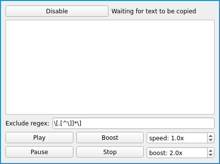

# ClipSay

Requirements:
* [boto3](https://github.com/boto/boto3) (connect it to your Amazon AWS account using the [steps described in the boto3 repo](https://github.com/boto/boto3#using-boto3))
* [mpv](https://github.com/mpv-player/mpv)
* [python-mpv](https://github.com/jaseg/python-mpv)
* [PyQt](https://wiki.python.org/moin/PyQt)

